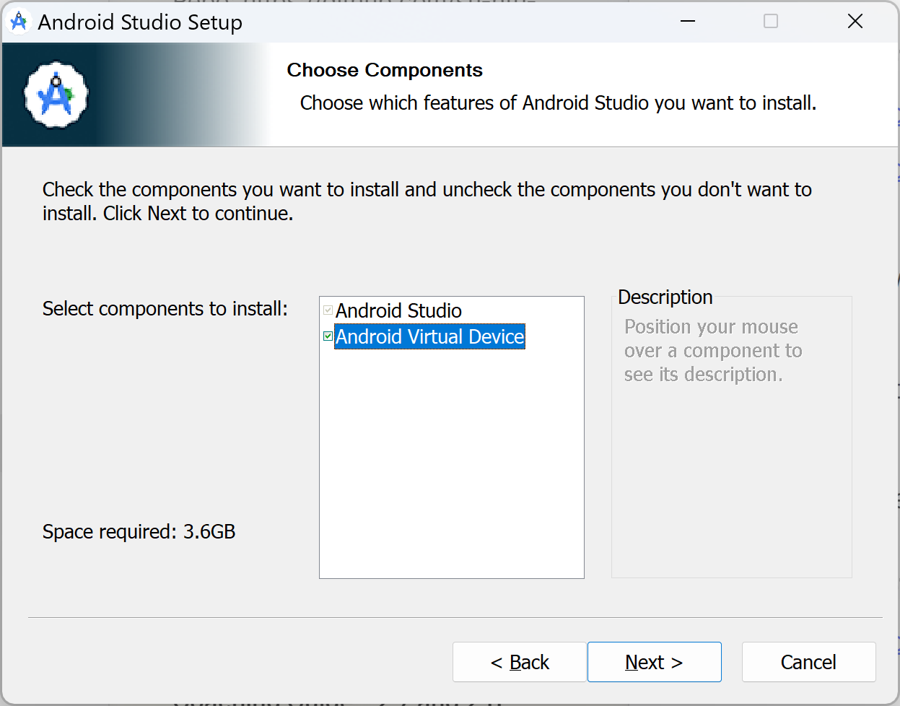
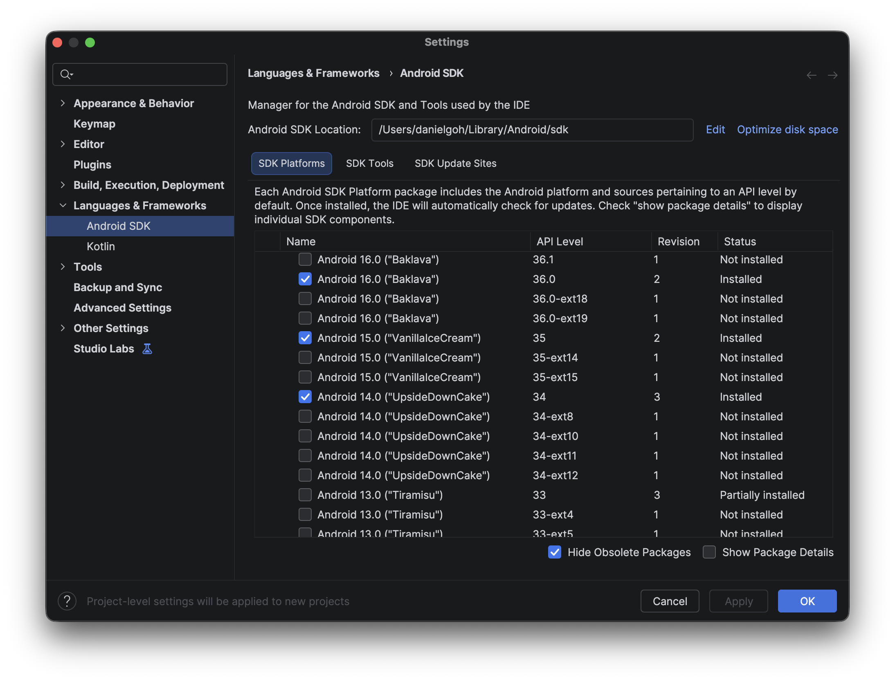
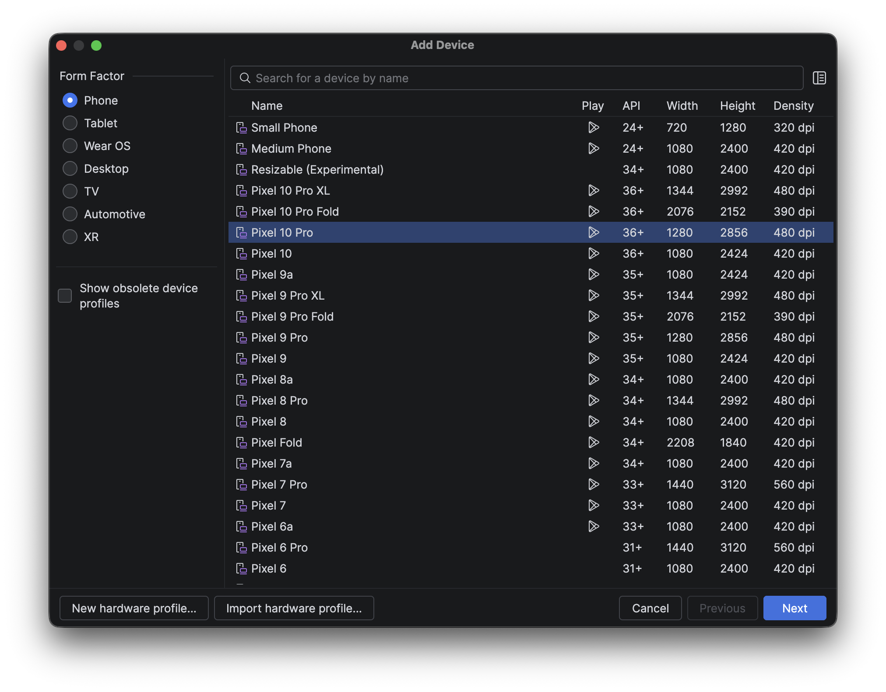

# Lesson 2.14: Introduction to Cross-Platform Mobile Application Development

## Overview

- **Duration:** ~2 hours (hands-on lab)
- **Prerequisites:** Lessons 2.1–2.13 (full React module)

## Learning Objectives

By the end of this lesson, you will be able to:

1. **Explain** how React Native differs from React for the web, and how the two share the same component model and hooks
2. **Set up** a React Native development environment using Expo and run an app on a physical device or Android emulator
3. **Build** a basic React Native app using core components and familiar hooks
4. **Debug** a running React Native app using React Native DevTools

## Introduction

So far in this module you have been building web applications with React. Today you will take those same skills and apply them to mobile development with React Native. The core ideas (components, props, state, and hooks) carry over directly. What changes is the set of UI building blocks you use. By the end of this lab you will have a working Expo project running on your own device or an emulator, a first app that uses `View`, `Text`, `StyleSheet`, and `useEffect`, and the ability to inspect and debug that app using React Native DevTools.

---

## Part 1: Environment Setup

### What is Expo?

Expo is a framework built on top of React Native that handles the complex parts of mobile development for you: project configuration, native build tooling, and device testing. Think of it the way Create React App or Vite scaffolds a React web project: Expo does the same for mobile.

For testing, Expo provides the **Expo Go** app, which lets you load your project on a real device by scanning a QR code, with no need to build or install a native binary.

The React Native team itself recommends starting new projects with Expo; see the official [Set up your environment](https://reactnative.dev/docs/environment-setup) guide, which directs learners to the Expo-based "Quick start" path rather than the native "Framework" path.

### Step 1: Create a new Expo project

Open a terminal and run:

```bash
npx create-expo-app --template blank my-first-rn-app
```

> The first time you run this, you may be prompted to install the `create-expo-app` package. Enter `y` to proceed.

You will then be prompted to choose an Expo SDK version:

```
? Select an Expo SDK version: › - Use arrow-keys. Return to submit.
❯   Latest (SDK 57) - Recommended for most projects
    For learning with Expo Go (SDK 54)
    Other SDK version…
```

Use the arrow keys to select **"For learning with Expo Go (SDK 54)"** and press Return. This lesson uses the Expo Go app to run your project on a physical device, and Expo Go only supports the SDK version it was built against, so choosing this option keeps your project compatible with the version of Expo Go you will install in Step 3.

The `--template blank` flag gives you a minimal project with no extra libraries pre-installed, which keeps things simple while you are learning.

Move into the project folder and open it in VS Code:

```bash
cd my-first-rn-app
code .
```

Take a moment to look at the generated files:

```
my-first-rn-app/
├── .claude/          # Settings for the Claude Code AI coding assistant (optional, not covered in this lesson)
├── assets/           # App icons and splash screen images
├── node_modules/
├── AGENTS.md         # Instructions for AI coding assistants (optional, not covered in this lesson)
├── App.js            # Your app's root component (this is where you will write your code)
├── CLAUDE.md         # Claude Code entry point; here it just points to AGENTS.md
├── app.json          # App configuration (name, version, Expo SDK version)
├── index.js          # Entry point: registers App as the root component
├── package.json
└── package-lock.json
```

A few things to notice compared to a React web project:

- There is no `index.html`; the native shell is provided by Expo and the device OS
- There is no `react-dom` in `package.json`; `react-native` takes its place as the renderer
- `index.js` is the true entry point. It calls `registerRootComponent(App)` from the `expo` package, which registers your `App` component as the root of the native app, similar to how `main.jsx` calls `createRoot(...).render(<App />)` in a Vite project. You will not need to edit this file
- `app.json` plays a similar role to `vite.config.js`: it controls how your app is built and identified
- Recent versions of `create-expo-app` also scaffold `AGENTS.md`, `CLAUDE.md`, and a `.claude/` folder. Expo now treats AI coding agents (such as Claude Code, Codex, and Cursor) as a first-class part of the development workflow, so new projects are scaffolded with agent-facing instructions and configuration alongside the usual human- and IDE-facing files. `AGENTS.md` holds project context and conventions for any AI agent to read; `CLAUDE.md` is Claude Code's entry point specifically, and here it simply imports `AGENTS.md`; `.claude/settings.json` configures Claude Code plugins for the project. These files are unrelated to React Native itself and are safe to ignore for this lesson. See [Expo: AI Agents](https://docs.expo.dev/agents) for more detail

> **Note:** Older Expo projects (and some tutorials) include a `babel.config.js` file for transpilation configuration. Newer projects created with SDK 54 or later configure this internally, so you may not see this file. Either way, it is managed by Expo and you will not need to edit it.

### Step 2: Start the development server

```bash
cd my-first-rn-app
npx expo start
```

This starts the **Metro bundler**, which watches your files and bundles your JavaScript for the device. You will see a QR code printed in the terminal.

> `npx expo start` runs the Expo CLI version pinned to your project, which avoids version mismatch errors that can occur with a globally installed CLI.

### Step 3: Run the app on your device

Install the **Expo Go** app on your phone:

- Android: [Expo Go on Google Play](https://play.google.com/store/apps/details?id=host.exp.exponent)
- iOS: [Expo Go on the App Store](https://apps.apple.com/app/expo-go/id982107779)

Then load your project:

- **Android:** open Expo Go and tap **Scan QR code**
- **iOS:** open the Camera app and point it at the QR code

You should see the default app screen: "Open up App.js to start working on your app!"

Make a small change (edit the text inside `App.js`) and watch the app update on your device immediately. This is **hot reload** in action.

> **Troubleshooting:** Your phone and laptop must be on the **same Wi-Fi network** for the QR scan to work. If you are on a campus or corporate network that blocks device-to-device traffic, try creating a mobile hotspot from your laptop and connecting your phone to it, then restart `npx expo start`.

---

### Step 4: Set up emulators and simulators

Testing on a real device is convenient, but an emulator or simulator lets you test across different screen sizes and OS versions without needing additional hardware. Which platforms you can set up depends on the machine you are using:

- **Android Emulator:** works on both **Mac and Windows**. Follow Step 4a
- **iOS Simulator:** only available on **Mac**, because it requires Xcode, which Apple does not distribute for Windows or Linux. If you are on Windows, skip Step 4b. You can still test on a real iPhone: the Expo dev server runs the same way on Windows, and the Expo Go app on a physical iPhone connects to it exactly as it would to a Mac-hosted server, since the dev server only serves JavaScript over the network and does not depend on the host OS. What you will not be able to do on Windows is run the iOS Simulator itself

Your instructor will also demonstrate both live. Set up whichever applies to your machine; you do not need both.

### Step 4a: Set up the Android Emulator (Mac and Windows)

**Install Android Studio**

Download and install Android Studio from [developer.android.com/studio](https://developer.android.com/studio).

During installation, make sure **Android Virtual Device (AVD)** is checked.



**Check that Android API Level 36 is installed**

Open Android Studio. Go to **More Actions → SDK Manager**. Under the **SDK Platforms** tab, confirm that **Android 16 (API Level 36)** is checked. If not, check it and click **Apply**.

> Expo SDK 54 targets API Level 36. Using a matching system image avoids version mismatch warnings when the emulator boots. See [Expo SDK 54 changelog](https://expo.dev/changelog/sdk-54) for the full list of supported versions.



**Check that the required SDK Tools are installed**

Still in the **SDK Manager**, switch to the **SDK Tools** tab and confirm the following are checked, then click **Apply**:

- **Android SDK Build-Tools:** compiles and packages your app into an installable Android build. Expo uses this behind the scenes even for a managed project
- **Android SDK Platform-Tools:** command-line utilities such as `adb`, which Expo uses to communicate with the emulator (or a connected device) and install Expo Go on it
- **Android Emulator:** the actual emulator engine that runs the virtual device you will create below
- **Android Emulator hypervisor driver** (Windows only): lets the emulator use hardware-accelerated virtualization on Windows, without which the emulator would run far slower

**Create a virtual device**

Go to **More Actions → Virtual Device Manager** and click **Create device**. Choose a Pixel phone model that shows the Play Store icon, then select **Baklava (API 36)** as the system image. Leave the other settings as default and click **Finish**.



**Set environment variables**

The Expo CLI needs to know where your Android SDK is installed.

On **Mac/Linux**, open `~/.zshrc` (or `~/.bashrc`) in the `nano` text editor:

```bash
nano ~/.zshrc
```

Add the following lines at the end of the file:

```bash
export ANDROID_HOME=$HOME/Library/Android/sdk
export PATH=$PATH:$ANDROID_HOME/emulator
export PATH=$PATH:$ANDROID_HOME/platform-tools
```

Save and exit `nano` with `Ctrl+O`, then `Enter` to confirm the filename, then `Ctrl+X` to exit.

Then reload it:

```bash
source ~/.zshrc
```

On **Windows**, open System Properties → Environment Variables and add `ANDROID_HOME` pointing to your SDK location (usually `C:\Users\<your-name>\AppData\Local\Android\Sdk`), then add `%ANDROID_HOME%\emulator` and `%ANDROID_HOME%\platform-tools` to the `Path` variable.

You can verify the setup by running:

```bash
emulator -list-avds    # should list the device you just created
adb devices            # should list connected devices (empty is fine for now)
```

**Launch the emulator from Expo**

Start the emulator from Android Studio by clicking the play button next to your virtual device. Once it has booted, go back to your Expo terminal and press `a`. Expo will install the Expo Go client on the emulator and load your app automatically.

> If the emulator window is too large, press `Ctrl+` (or `Cmd+`) and use the arrow keys to resize it.

Full reference: [Expo: Android Studio Emulator](https://docs.expo.dev/workflow/android-studio-emulator/)

---

### Step 4b: Set up the iOS Simulator (Mac only)

> This step requires a Mac. If you are on Windows or Linux, skip to Step 5 and continue testing with Expo Go on a physical device or the Android Emulator.

**Install Xcode**

Open the App Store on your Mac and install **Xcode**. This is a large download (several GB), so start it early if you plan to follow along.

**Install the Xcode Command Line Tools**

Once Xcode has finished installing, open it once to accept its license agreement, then install the command line tools:

```bash
xcode-select --install
```

**Verify the Simulator is available**

```bash
xcrun simctl list devices available
```

This should print a list of available iOS Simulator devices (for example, "iPhone 16"). If the command is not found, confirm Xcode finished installing and try again.

**Launch the simulator from Expo**

With your Expo development server still running (`npx expo start`), press `i` in the terminal. Expo will boot the default iOS Simulator, install the Expo Go client on it, and load your app automatically.

> The first launch can take a minute or two while the simulator boots and Expo Go installs. Subsequent launches are much faster.

Full reference: [Expo: iOS Simulator](https://docs.expo.dev/workflow/ios-simulator/)

---

### Step 5: Mirror your physical device to your laptop screen

If you are testing on a physical phone rather than an emulator or simulator, it is much easier to demo your work, take screenshots, or have your instructor look at your screen if your phone's display is mirrored onto your laptop. The setup differs depending on your phone and computer.

**iPhone, mirrored to a Mac**

Screen mirroring is built into macOS, no extra software required.

1. Connect your iPhone to your Mac with a cable (the first time only; after pairing, you can mirror over Wi-Fi)
2. Open the **iPhone Mirroring** app on your Mac (Sequoia or later)
3. Your iPhone's screen appears in a window on your Mac, and you can control it with your mouse and keyboard

> **Note:** iPhone Mirroring requires macOS Sequoia (15) or later, and your iPhone must have the screen locked with Face ID/Touch ID during mirroring, per Apple's design. It does not work with an Android phone.

**Android phone, mirrored with `scrcpy`**

[`scrcpy`](https://github.com/Genymobile/scrcpy) ("screen copy") is a free, open-source tool that mirrors an Android device's screen to your computer, and works on Mac, Windows, and Linux.

Install it:

```bash
# Mac (using Homebrew)
brew install scrcpy

# Windows (using winget)
winget install scrcpy
```

**Enable Developer options and USB debugging**

On most Android phones, **Developer options** is hidden by default. To reveal it:

1. Open **Settings → About phone**
2. Find **Build number** and tap it **7 times** in a row. You should see a message like "You are now a developer!"
3. Go back to the main **Settings** screen; a new **Developer options** menu will now appear (often under **System**)
4. Open **Developer options** and enable **USB debugging**

> The exact menu path varies slightly by phone manufacturer (Samsung, Pixel, etc.), but the "tap Build number 7 times" step is the same on every Android device.

Connect your Android phone via USB. Then run:

```bash
scrcpy
```

Your phone's screen should appear in a window on your computer within a few seconds, and you can interact with it using your mouse and keyboard.

> **Troubleshooting:** If `scrcpy` reports no devices found, check that `adb devices` (installed as part of the Android SDK Platform-Tools in Step 4a) lists your phone. You may need to tap **Allow** on a "USB debugging" prompt on your phone the first time you connect.

---

## Part 2: Your First React Native App

### Core components

In React for the web, you build UIs from HTML elements: `<div>`, `<p>`, `<button>`, and so on. React Native does not have HTML; instead it provides its own set of primitive components that map to native UI elements on each platform.

The three you will use today:

| React Native | Closest HTML equivalent | Purpose                    |
| ------------ | ----------------------- | -------------------------- |
| `View`       | `<div>`                 | A generic layout container |
| `Text`       | `<p>`, `<span>`         | Displays text              |
| `Button`     | `<button>`              | A simple tap target        |

### Step 1: Start with a `View`

Open `App.js` and replace its contents with the following:

```jsx
// App.js
import { View } from "react-native";

export default function App() {
  return <View style={{ flex: 1, backgroundColor: "#fff" }} />;
}
```

**Device check:** you should see a blank white screen. That is expected: a `View` is just a layout container, similar to an empty `<div>`. It has nothing to display yet.

Notice the inline `style={{ flex: 1, backgroundColor: "#fff" }}`. Styles in React Native are plain JavaScript objects passed via the `style` prop, not CSS classes; you will see a cleaner way to write them shortly, but an inline object works for a quick check like this one.

> `flex: 1` tells the `View` to expand and fill the available space. Without it, the `View` would collapse to the size of its content, which here is nothing at all, so you would see nothing on screen.

### Step 2: Add `Text` inside the `View`

React Native does not let you render raw text on its own; text must always be wrapped in a `Text` component. Update `App.js`:

```jsx
// App.js
import { Text, View } from "react-native";

export default function App() {
  return (
    <View
      style={{
        flex: 1,
        backgroundColor: "#fff",
        alignItems: "center",
        justifyContent: "center",
      }}
    >
      <Text>My First React Native App</Text>
    </View>
  );
}
```

**Device check:** you should now see the text "My First React Native App" centred on the screen.

`alignItems: "center"` centres children along the horizontal axis, and `justifyContent: "center"` centres them along the vertical axis. You will cover Flexbox layout properly in Lesson 2.15; for now, adding these two lines just keeps the screen looking tidy as you build.

Two important rules to remember:

1. **All text must be inside a `Text` component.** Rendering a bare string as a child of `View` will throw an error.
2. **`View` cannot contain raw text directly.** Wrap any text in `Text` first.

Try it yourself: remove the `<Text>` tags and leave just the string (`My First React Native App`) as a direct child of `View`. Reload the app and read the red error screen, then put the `<Text>` tags back. See **Common Pitfalls** at the end of this lesson for another look at this mistake.

---

### Activity: Build a Timer (20 minutes)

You already know `useState` and `useEffect` from the React web lessons; they work exactly the same way in React Native. Use them to turn the static screen above into a live, running timer.

**Task:** Update `App.js` so that:

1. A piece of state called `seconds` starts at `0`
2. Once the app loads, `seconds` increases by `1` every second, without you needing to press anything
3. The screen displays the current count, for example `Seconds elapsed: 0`, updating live as the count changes
4. The interval is cleaned up correctly (no warnings in the JS Debugger console when the app reloads)

**Hints:**

1. Add `const [seconds, setSeconds] = useState(0);` inside your `App` component
2. `useEffect` with an empty dependency array (`[]`) runs once when the component mounts, which is where you should start a `setInterval`
3. Inside the interval callback, update state with the functional form: `setSeconds((prev) => prev + 1)`
4. `useEffect` can return a cleanup function; return `() => clearInterval(timer)` so the interval is cleared if the component unmounts
5. Render the count inside a `Text` component using `{seconds}`, the same interpolation syntax you used in JSX for the web

<details>
<summary>Reference solution</summary>

```jsx
// App.js
import { Text, View } from "react-native";
import { useState, useEffect } from "react";

export default function App() {
  const [seconds, setSeconds] = useState(0);

  useEffect(() => {
    const timer = setInterval(() => {
      setSeconds((prev) => prev + 1);
    }, 1000);

    return () => clearInterval(timer);
  }, []);

  return (
    <View
      style={{
        flex: 1,
        backgroundColor: "#fff",
        alignItems: "center",
        justifyContent: "center",
      }}
    >
      <Text>My First React Native App</Text>
      <Text>Seconds elapsed: {seconds}</Text>
    </View>
  );
}
```

The cleanup function (`return () => clearInterval(timer)`) runs when the component unmounts, preventing the interval from continuing to fire after the component is gone. This is the same pattern you used in the web lessons.

</details>

### Step 3: Add a Start/Pause button

Now add a `Button` to toggle the timer on and off. `Button` is the simplest interactive component in React Native. You will learn to build a fully customised button with `Pressable` in a later lesson.

```jsx
// App.js
import { Button, Text, View } from "react-native";
import { useState, useEffect } from "react";

export default function App() {
  const [seconds, setSeconds] = useState(0);
  const [isRunning, setIsRunning] = useState(true);

  useEffect(() => {
    if (!isRunning) return;

    const timer = setInterval(() => {
      setSeconds((prev) => prev + 1);
    }, 1000);

    return () => clearInterval(timer);
  }, [isRunning]);

  return (
    <View
      style={{
        flex: 1,
        backgroundColor: "#fff",
        alignItems: "center",
        justifyContent: "center",
      }}
    >
      <Text>My First React Native App</Text>
      <Text>Seconds: {seconds}</Text>
      <Button
        title={isRunning ? "Pause" : "Start"}
        onPress={() => setIsRunning((prev) => !prev)}
      />
    </View>
  );
}
```

**Device check:** tapping the button should pause and resume the timer.

A few things to note about the `useEffect` here:

- When `isRunning` is `false`, the effect returns early; there is nothing to set up or clean up
- When `isRunning` is `true`, the effect starts a new interval and returns its cleanup function
- React runs the cleanup automatically before the effect re-runs (when `isRunning` changes) and when the component unmounts, so there is never more than one interval running at a time

### Step 4: Style the timer with `StyleSheet`

The app works, but everything is left-aligned and unstyled. React Native does not use CSS files or class names; instead, styles are JavaScript objects passed via the `style` prop, as you already saw with the inline style in Step 1. The `StyleSheet.create()` function lets you define those objects once and reuse them, and it validates your styles at development time.

> You will cover layout and styling in React Native in much more depth in Lesson 2.15. For now, treat this as a brief introduction so your timer looks presentable, not a full styling lesson.

```jsx
// App.js
import { StatusBar } from "expo-status-bar";
import { Button, StyleSheet, Text, View } from "react-native";
import { useState, useEffect } from "react";

export default function App() {
  const [seconds, setSeconds] = useState(0);
  const [isRunning, setIsRunning] = useState(true);

  useEffect(() => {
    if (!isRunning) return;

    const timer = setInterval(() => {
      setSeconds((prev) => prev + 1);
    }, 1000);

    return () => clearInterval(timer);
  }, [isRunning]);

  return (
    <View style={styles.container}>
      <Text style={styles.title}>My First React Native App</Text>
      <Text style={styles.counter}>Seconds: {seconds}</Text>
      <Button
        title={isRunning ? "Pause" : "Start"}
        onPress={() => setIsRunning((prev) => !prev)}
      />
      <StatusBar style="auto" />
    </View>
  );
}

const styles = StyleSheet.create({
  container: {
    flex: 1,
    backgroundColor: "#fff",
    alignItems: "center",
    justifyContent: "center",
  },
  title: {
    fontSize: 24,
    fontWeight: "bold",
    marginBottom: 16,
  },
  counter: {
    fontSize: 32,
    marginBottom: 24,
  },
});
```

Notice the new `StatusBar` import from `expo-status-bar`: it controls the appearance of the device's top status bar (the row showing the time and battery). You can leave it as `style="auto"` for now.

**Device check:** the title, counter, and button should now be centred on screen, with the title in bold and the counter in a larger font.

Things that differ from CSS:

- Property names are **camelCase** (`backgroundColor`, not `background-color`)
- There are **no units**: numbers are density-independent pixels by default
- **Flexbox is the default layout system**: `flex: 1` makes a container fill available space

---

### Activity: Build a +/- Counter (20 minutes)

Now build a second, independent screen component to practice the same core components and hooks on a fresh example: a counter with a `+` button and a `-` button.

**Task:** Update `App.js` so that:

1. A piece of state called `count` starts at `0`
2. A `Text` component displays the current count
3. A `+` `Button` increases `count` by `1` each time it is pressed
4. A `-` `Button` decreases `count` by `1` each time it is pressed
5. Style the screen using `StyleSheet.create()` so the count and buttons are centred on screen, similar to the timer above

**Hints:**

1. Add `const [count, setCount] = useState(0);` inside your `App` component
2. Each `Button` needs its own `onPress` handler; use the functional state update form, `setCount((prev) => prev + 1)` and `setCount((prev) => prev - 1)`
3. You can render two `Button` components side by side inside a `View`; give that `View` a style of `{ flexDirection: "row", gap: 16 }` to lay them out horizontally with spacing between them
4. Reuse the same `StyleSheet.create()` pattern from Step 4 for the container and text styles

<details>
<summary>Reference solution</summary>

```jsx
// App.js
import { Button, StyleSheet, Text, View } from "react-native";
import { useState } from "react";

export default function App() {
  const [count, setCount] = useState(0);

  return (
    <View style={styles.container}>
      <Text style={styles.count}>{count}</Text>
      <View style={styles.buttonRow}>
        <Button title="-" onPress={() => setCount((prev) => prev - 1)} />
        <Button title="+" onPress={() => setCount((prev) => prev + 1)} />
      </View>
    </View>
  );
}

const styles = StyleSheet.create({
  container: {
    flex: 1,
    backgroundColor: "#fff",
    alignItems: "center",
    justifyContent: "center",
  },
  count: {
    fontSize: 48,
    fontWeight: "bold",
    marginBottom: 24,
  },
  buttonRow: {
    flexDirection: "row",
    gap: 16,
  },
});
```

There is no `useEffect` here: unlike the timer, the count only ever changes in response to a button press, so there is no ongoing side effect to set up or clean up.

</details>

---

## Part 3: Debugging Your App

Now that you have a running timer with actual state to inspect, this is a good moment to learn how to look inside your app while it runs, rather than only relying on `console.log` and guesswork.

### Opening React Native DevTools

Older React Native tutorials mention installing a separate `react-devtools` package, or opening a `chrome://inspect` tab. Neither of those applies anymore. Modern React Native (and Expo SDK 54) ships its own built-in debugger, called **React Native DevTools**, which you open directly from your running app; there is nothing extra to install.

> **Prerequisite:** React Native DevTools renders its interface using a bundled Chromium-based frontend, so you need **Google Chrome or Microsoft Edge installed** on your computer (it does not need to be your default browser).

Open the Dev Menu, then choose to open DevTools:

- **Universal shortcut:** with `npx expo start` running, press `j` in that terminal
- **Android Emulator:** press `Ctrl+M` (or `Cmd+M` on Mac) to open the Dev Menu, then tap **Open DevTools**
- **iOS Simulator:** press `Cmd+Ctrl+Z` to open the Dev Menu, then tap **Open DevTools**
- **Physical device (Android or iOS):** shake the device to open the Dev Menu, then tap **Open DevTools**

A new window opens on your computer, separate from your normal browser tabs. This is React Native DevTools.

### Touring the DevTools window

With your timer app still running, explore these tabs. They will feel familiar: they are the same Console, Components, and Profiler tools you have already used in the React DevTools browser extension during the React web lessons.

**Console**

Add a `console.log` inside the timer's `useEffect`, just above `setSeconds((prev) => prev + 1)`:

```jsx
// App.js
useEffect(() => {
  if (!isRunning) return;

  const timer = setInterval(() => {
    console.log("tick", seconds);
    setSeconds((prev) => prev + 1);
  }, 1000);

  return () => clearInterval(timer);
}, [isRunning]);
```

**Device check:** in the **Console** tab of DevTools, you should see a new `tick` log appear every second. This is the same `console.log` you have already used throughout the React web lessons; it works identically here.

Remove the `console.log` line when you are done, so you are not left with a stray console statement in your code.

**Components**

Open the **Components** tab. This shows your component tree (`App` and its children), the same view as the React DevTools browser extension you used in the web lessons. Select `App` in the tree and look at the **hooks** panel on the right; you should see your `seconds` and `isRunning` state values updating live as the timer runs.

**Profiler**

Open the **Profiler** tab. This is the same profiler you used in the web lessons to record renders and see which components re-rendered and why. Click **Record**, let the timer tick a few times, then stop recording; you should see `App` re-rendering roughly once per second, driven by the `seconds` state update.

> React Native DevTools deeply integrates React DevTools directly into these **Components** and **Profiler** tabs. You do not need to install the separate `react-devtools` package; that standalone tool is only relevant for much older React Native versions.

---

## Bonus Challenges

Work on as many as you can; they are listed in order of difficulty.

### Challenge 1: Reset button

Add a second `Button` labelled "Reset" that stops the counter and resets `seconds` back to zero.

**Hints:**

- You will need to set both `isRunning` to `false` and `seconds` to `0` in the handler
- Render the two buttons side by side using a `View` with `flexDirection: 'row'` and a `gap` between them

### Challenge 2: MM:SS display

Instead of showing a raw number of seconds, display elapsed time in `MM:SS` format (for example, `01:05`).

**Hints:**

- `Math.floor(seconds / 60)` gives you the minutes; `seconds % 60` gives you the remaining seconds
- `String.padStart(2, '0')` left-pads a number with a leading zero when it is less than 10

### Challenge 3: Lap times

Add a "Lap" button that records the current elapsed time. Display the list of recorded lap times below the counter.

**Hints:**

- Add a `laps` state as an array, initialised to `[]`
- Each time the Lap button is pressed, append the current `seconds` value to `laps`
- Render the list using `.map()`; you will not need `FlatList` for a short list, so plain `Text` components inside a `View` are fine for now

---

## Common Pitfalls

**Text outside of a `Text` component**

```jsx
// Wrong: will throw an error
<View>
  Hello
</View>

// Correct
<View>
  <Text>Hello</Text>
</View>
```

**Using CSS property names**

```jsx
// Wrong: kebab-case and string values do not work
const styles = StyleSheet.create({
  box: {
    "background-color": "red",
    "font-size": "16px",
  },
});

// Correct: camelCase, no units
const styles = StyleSheet.create({
  box: {
    backgroundColor: "red",
    fontSize: 16,
  },
});
```

**Making the `useEffect` callback itself `async`**

```jsx
// Wrong: useEffect expects a cleanup function or nothing, not a Promise
useEffect(async () => {
  await doSomething();
}, []);

// Correct: define the async function inside and call it
useEffect(() => {
  async function run() {
    await doSomething();
  }
  run();
}, []);
```

---

## Summary

- **React Native vs React web:** the component model and hooks are identical; only the UI primitives change (`View` and `Text` instead of `div` and `p`)
- **Expo:** a managed framework that handles project setup, native tooling, and device testing via the Expo Go app
- **Core components:** `View` for layout, `Text` for all text output, `Button` for simple tap interactions
- **Styling:** JavaScript objects with camelCase property names, no units, Flexbox by default
- **Hooks:** `useState` and `useEffect` behave exactly as they do in React web; the cleanup pattern and dependency array work the same way
- **Debugging:** React Native DevTools is built in and opens directly from your running app (press `j`, or shake a physical device); no separate `react-devtools` install or `chrome://inspect` tab required. Its Console, Components, and Profiler tabs are the same tools used in the React web lessons

---

## Additional Resources

- [Expo: Get Started](https://docs.expo.dev/get-started/introduction/)
- [React Native: Core Components](https://reactnative.dev/docs/components-and-apis)
- [React Native: Style](https://reactnative.dev/docs/style)
- [Expo: Android Studio Emulator Setup](https://docs.expo.dev/workflow/android-studio-emulator/)
- [Expo: Debugging Tools](https://docs.expo.dev/debugging/tools/)
- [React Native: React Native DevTools](https://reactnative.dev/docs/react-native-devtools)
